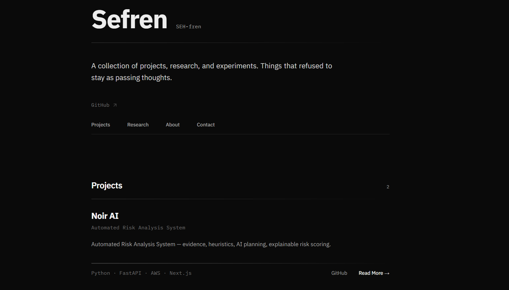

# Sefren — Portfolio

A personal portfolio built with **Next.js (App Router)** and **TailwindCSS**, deployed on **Vercel**.  

_Refined with AI ✦_

---

## Showcase



---

## Features
- Project showcase with detail pages
- Research highlights
- About + Contact
- Clean, typography-focused design

---

## Setup

Install dependencies:
```bash
npm install
````

Run development server:

```bash
npm run dev
```

Open [http://localhost:3000](http://localhost:3000).

Build for production:

```bash
npm run build
npm run start
```

---

## Deployment

Deploy on **Vercel**:

```bash
vercel --prod
```

---

## Tech Stack

* Next.js (App Router)
* TailwindCSS
* Lucide Icons
* Vercel

---

## License

MIT License — free to use/adapt with attribution.

[License](./LICENSE) · [GitHub](https://github.com/sefren)


